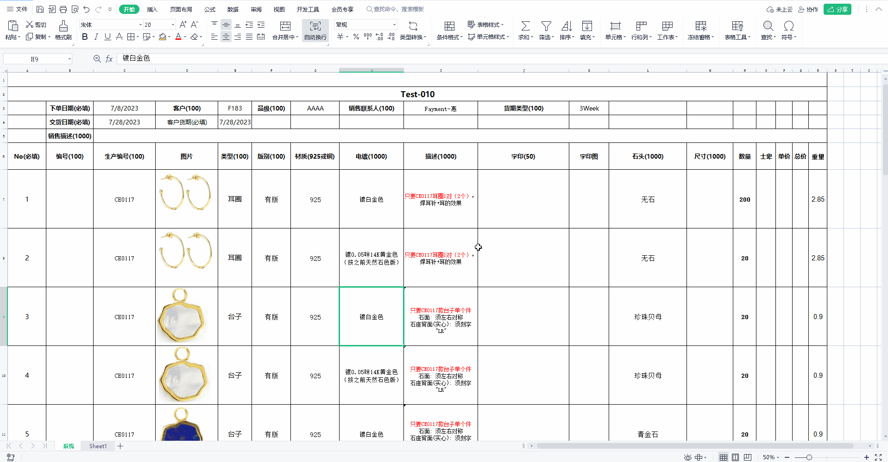
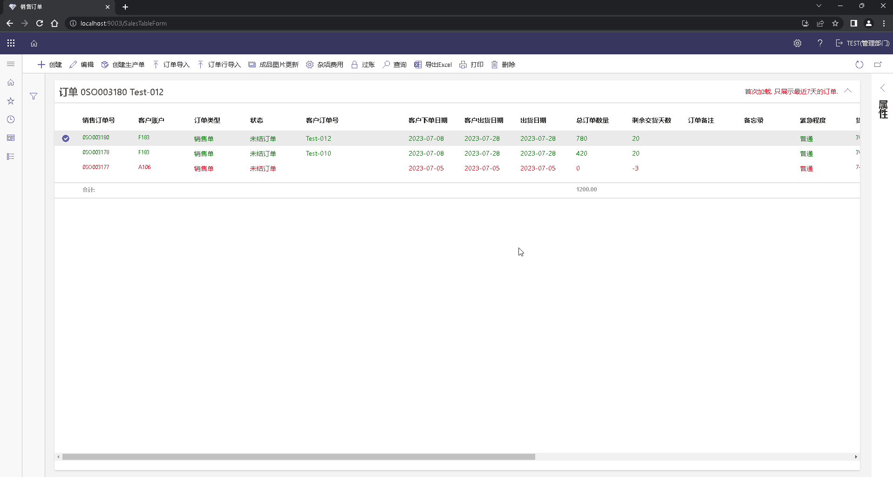
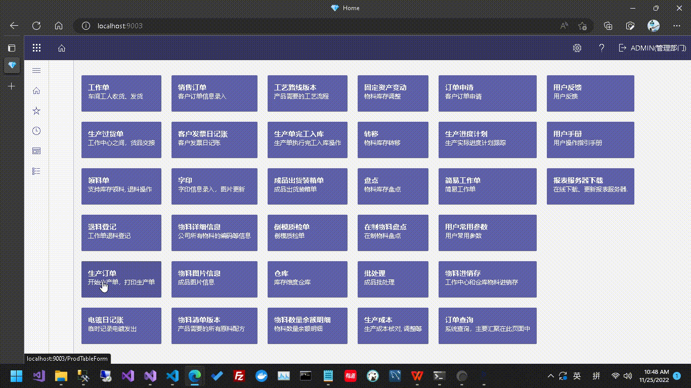
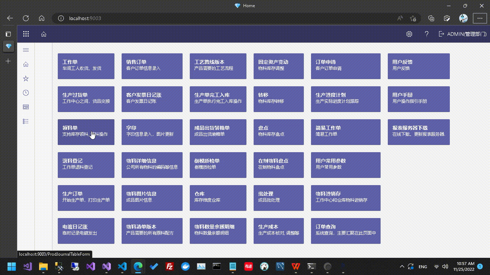
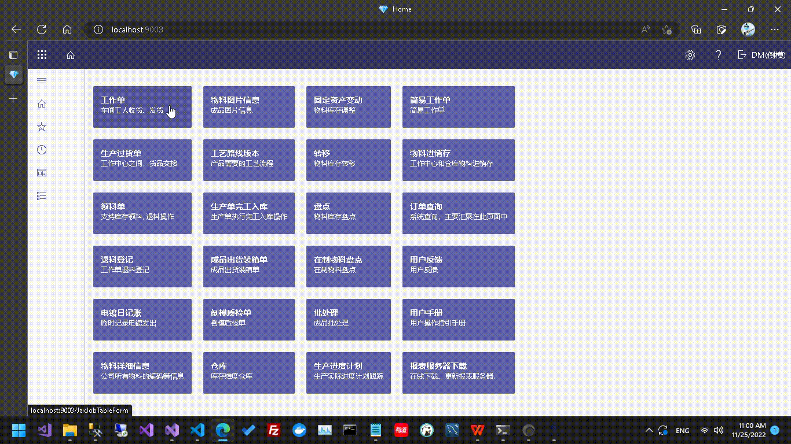
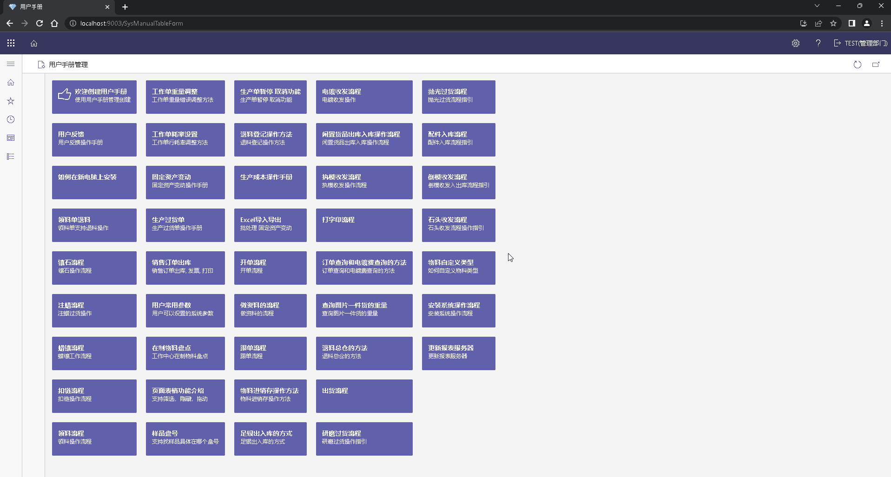

## 我们
- 我们专注**珠宝制造**行业15年
- 我们的ERP产品，源自微软**Dynamics AX**、**Dynamics 365**优秀的管理和设计理念
- 我们为中小企业提供全面的、有竞争力的信息化、数字化解决方案
- 欢迎与我们合作，包括但不限于：企业信息化、数字化，珠宝设计、生产、销售等

## 联系
- Email: 1306255385@qq.com
- Github: https://github.com/it950

## 系统模块
- 销售管理(Account Receivable)
- 采购管理(Account Payable)
- 库存管理(Inventory Management)
- 生产管理(Production)
- 总账(Ledger Account)
- 人力资源管理(HR)
- RFID设计与开发

## 在线试用
Please contact us by email(1306255385@qq.com)

### 销售订单管理
>
> 支持通过导入Excel，**批量创建订单**，同时也支持**手动创建订单**
>
> 支持直接将**Excel的图片**，导入系统，加快订单创建速度
>

- 编辑订单数据(Excel)

- 导入订单数据(Excel)

- 创建生产单

### 生产订单管理
>
> 生产订单是企业为满足客户的需求，由计划部门向生产车间下达，并要求生产车间执行的生产任务。 
>
> 包含生产订单打印、开始、领料单、工作单、完工入库等。
>

- 领料单
  

- 物料进销存
  

### 用户手册
>
> 指导用户如何使用系统，同时，用户可以根据公司使用情况，添加自己的手册
>

